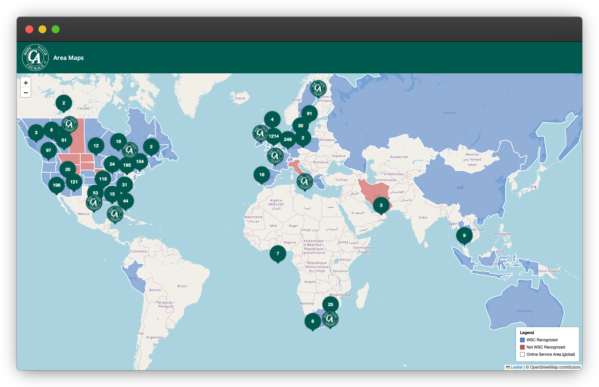

### Cocaine Anonymous Interactive Area Maps

An interactive global map dispalying all C.A. Areas.

[https://cawscit.github.io/area-maps/](https://cawscit.github.io/area-maps/)

**Note**: The borders in this project _are not_ perfect. They are designed to be "close enough". If your location is represented by the wrong area in this interactive map, please contact WSCSB or WSCIT with details confirmed from the World Service Conference so it can be adjusted.

To update these maps, [read the the documentation.](docs/UPDATING_MAPS.md)

## Disclaimer
In the spirit of Tradition Six, C.A. is not allied with any sect, denomination, politics, organization, or institution and as such does not endorse and is not affiliated with any of the specific technology providers utilized to provide this software.
